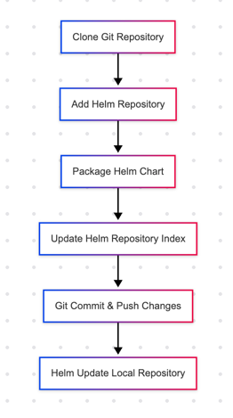

# Creating and Updating Your Helm Repository Tutorial



This tutorial guides you step-by-step through cloning a Helm repository, packaging a Helm chart, and updating your repository index.

## Step 1: Clone the Repository

Begin by cloning your repository to your local machine:

```bash
git clone git@github.com:nstarx/helm.git
```

Navigate into the cloned directory:
```bash
cd helm
```

## Step 2: Add Your Helm Repository

Add your Helm repository using Helm CLI:

```bash
helm repo add nstarx-helm https://nstarx.github.io/helm
```

## Step 3: Package Your Helm Chart

Navigate to your chart directory (e.g., sample-webapp) and package it:

```bash
helm package ./sample-webapp/
```


This command will create a .tgz archive in the current directory.

## Step 4: Update the Helm Repository Index

Update your Helm repository's index file (index.yaml) to reflect the newly packaged chart:

```bash
helm repo index . --url https://nstarx.github.io/helm
```

## Step 5: Commit and Push Changes

Stage, commit, and push your changes back to GitHub:

```bash
git add .
git commit -m 'update with my helm repo'
git push origin
```

## Step 6: Update Local Helm Repository

Finally, update your local Helm repository to reflect the changes:

```bash
helm repo update
helm search repo nstarx-helm
```
>please wait 50 seconds for the github pages to update

Your Helm chart should now appear in the repository search results. You've successfully packaged and published a Helm chart!
